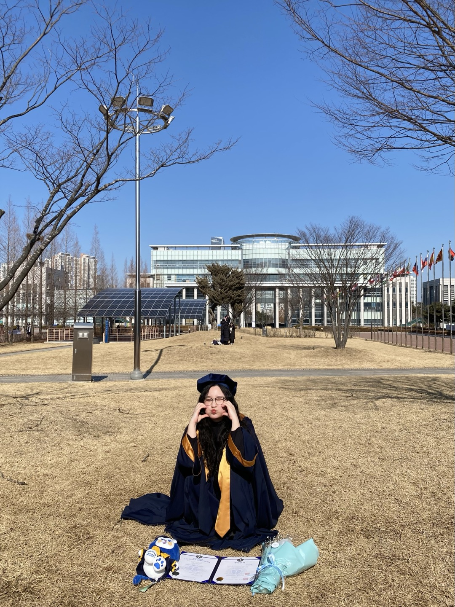

# 🥔 데이터하는 감자들

**데이터와 AI로 세상을 바꾸는 감자들의 실험실**  
> 데이터 기반의 문제 해결과 AI 에이전트를 활용한 자동화 서비스 개발을 추구하는 팀입니다.

---

## 💡 About Us

**데이터하는 감자들**은 데이터 분석, Reasoning AI에 관심 있는 멤버들이 모여  
공공데이터를 기반으로 한 혁신적인 서비스를 개발하고 있습니다.

- **위치 기반 맞춤형 정보**와 **LLM 기반 AI 상담사**의 대화를 결합한 통합 서비스  
- 공공 데이터를 활용해 **소방관의 실무 효율성을 극대화**하는 서비스  
- 통일교육, 역사 교육 등 다양한 분야에 활용 가능한 **디지털 아카이빙 도구** 등 시도 중!

---

## 👨‍👩‍👧‍👦 Members; Potatoes

| Who | 이름 | 역할 & 분야 | 링크 |
|------|------|-------------|------|
|  | **양유진** | 🎯 PM / AI Agent 설계 🧠 Reasoning AI, Agentic Workflow |    |
|  | **반예주** | 🧩 프론트엔드 개발 🎨 React 커스터마이징 |   |
|  | **송지혜** | 📊 데이터 사이언티스트 📈 ML 모델링 / 시각화 |   |
|  | **임하진** | 🪙 서비스 기획 / BM 설계 🛜 인프라 구축 |   |

---

## 🚀 Project

| 프로젝트명 | 설명 | 레포지토리 |
|------------|------|------------|
| 🗺️ AI와 지도가 함께하는 통일 동행 맵 | 위치 기반 사회적 지지망 시각화와 AI 상담사가 함께하는 탈북 여성 및 청소년 지원 서비스 | [🔗 바로가기](https://github.com/PotatoDoingData/AI-map) |
| 🚒 소방관 실무 지원 앱 | 실시간 사고 및 병상 정보를 활용한 소방관 업무 효율화 앱 | [🔗 바로가기](https://github.com/PotatoDoingData/firefighter) |
| 🕰️ 남북한 역사 타임라인 앱 | 남북한의 역사를 인터랙티브하게 보여주는 타임라인 앱 서비스 | [🔗 바로가기](https://github.com/PotatoDoingData/TimeInter) |
| 😋 맛.ZIP | 외국인 맛춤형 AI 관광 서비스 | [🔗 바로가기](https://github.com/PotatoDoingData/mat.ZIP) |

---

## 🏆 Awards

| 수상명 | 주최 / 기관 | 연도 |
|--------|--------------|------|
| 🥇 **통일부 공공데이터 활용 공모전 - 아이디어 기획 부문 장려상** | 통일부 | 2025 |
| 🥈 **DIVE 2025 - 발제사별 시상 1등(BNK 금융그룹 회장상)** | 부산광역시 / 재단법인 부산테크노파크 | 2025 |

---

## ✨ Tech Stack

---

## 📫 Contact

- 🔗 팀 노션: [데이터하는 감자들' Notion](https://www.notion.so/34d6bec81e3580ada5d2f5536dd9c064?source=copy_link) 
- 🙋‍♀️ 협업 제안은 언제든 환영합니다!

---

  
🌱 **오늘도 우리의 가능성에 물을 주기**

감자처럼 작지만, 삶을 바꾸는 에너지를 품고 있는 팀.

